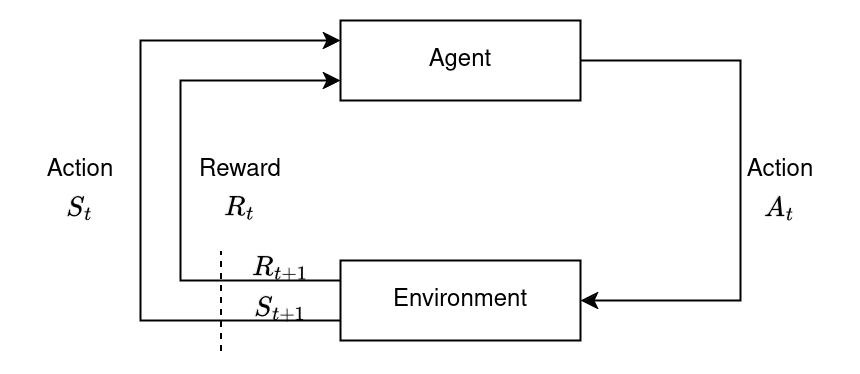

# Agent-Environment Interaction



# Return

$$
\begin{align*}
G_t &\doteq R_{t+1} + \gamma R_{t+2} + \gamma^2 R_{t+3} + \cdots \\
    &= \sum_{k=0}^{\infty} \gamma^{k} R_{t+k+1} \\
    &= R_{t+1} + \gamma G_{t+1} \\
\end{align*}
$$

$\gamma=\left[0,1\right]$ is a discount rate.

# State Value Function for Policy $\pi$

$$
\begin{align*}
v_\pi\left(s\right) &\doteq \mathbf{E}_\pi\left[G_t{\vert}S_t=s\right] \\
    &= \mathbf{E}_\pi\left[R_{t+1}+\gamma G_{t+1}{\vert}S_t=s\right] \\
    &= \sum_a \pi\left(a{\vert}s\right) \sum_{s'} \sum_{r'} p\left(s',r{\vert}s,a\right) \left[r+\gamma\mathbf{E}_\pi\left[G_{t+1}{\vert}S_{t+1}=s'\right]\right] \\
    &= \sum_a \pi\left(a{\vert}s\right) \sum_{s',r} p\left(s',r{\vert}s,a\right) \left[r+{\gamma}v_\pi\left(s'\right)\right] \\
\end{align*}
$$

The last equation is called as Bellman equation for $v_\pi$. $\pi(a|s)$ is the probability that
$A_t=a$ if $S_t=s$.

$$p\left(s',r{\vert}s,a\right) \doteq \Pr\left\{S_t=s',R_t=r{\vert}S_{t-1}=s,A_{t-1}=a\right\}$$

# Action Value Function for Policy $\pi$

$$
\begin{align*}
q_\pi\left(s,a\right) &\doteq \mathbf{E}_\pi\left[G_t{\vert}S_t=s, A_t=a\right] \\
    &= \sum_{s',r} p\left(s',r{\vert}s,a\right) \left[r+{\gamma}v_\pi\left(s'\right)\right]\\
\end{align*}
$$

$$
\begin{align*}
v_\pi\left(s\right) &\doteq \mathbf{E}_\pi\left[G_t{\vert}S_t=s\right] \\
    &= \sum_a \mathbf{E}_\pi\left[G_t{\vert}S_t=s, A_t=a\right] \pi\left(a{\vert}s\right)\\
    &= \sum_a q_\pi\left(s,a\right) \pi\left(a{\vert}s\right)
\end{align*}
$$

# Optimal Policies and Optimal Value Functions

$$v_*\left(s\right) \doteq \max_\pi v_\pi\left(s\right)$$

$$q_*\left(s,a\right) \doteq \max_\pi q_\pi\left(s,a\right)$$ 

$$
\begin{align*}
v_*\left(s\right) &\doteq \max_\pi v_\pi\left(s\right) \\
    &= \max_a q_{\pi_*}\left(s,a\right) \\
    &= \max_a \mathbf{E}_{\pi_*} \left[G_t{\vert}S_t=s,A_t=a\right] \\
    &= \max_a \mathbf{E}_{\pi_*} \left[R_{t+1}+{\gamma}G_{t+1}{\vert}S_t=s,A_t=a\right] \\
    &= \max_a \mathbf{E} \left[R_{t+1}+{\gamma}v_*\left(S_{t+1}\right){\vert}S_t=s,A_t=a\right] \\
    &= \max_a \sum_{s',r} p\left(s',r{\vert}s,a\right) \left[r+{\gamma}v_*\left(s'\right)\right]
\end{align*}
$$

$$
\begin{align*}
q_*\left(s,a\right) &\doteq \max_\pi q_\pi\left(s,a\right) \\
    &= \mathbf{E} \left[R_{t+1}+{\gamma}{\max_{a'}}{q_*}\left(S_{t+1},a'\right){\vert}S_t=s,A_t=a\right] \\
    &= \sum_{s',r} p\left(s',r{\vert}s,a\right) \left[r+{\gamma}{\max_{a'}}{q_*}\left(s',a'\right)\right]
\end{align*}
$$

# Dynamic Programming

[Source](https://colab.research.google.com/gist/cwkx/670c8d44a9a342355a4a883c498dbc9d/dynamic-programming.ipynb)

- policy evaluation
    <details>
    <summary>code</summary>

    ```python
    def policy_evaluation(env, policy, gamma=1, theta=1e-8):
        V = np.zeros(env.nS)
        while True:
            delta = 0
            for s in range(env.nS):
                Vs = 0
                for a, action_prob in enumerate(policy[s]):
                    for prob, next_state, reward, done in env.P[s][a]:
                        Vs += action_prob * prob * (reward + gamma * V[next_state])
                delta = max(delta, np.abs(V[s]-Vs))
                V[s] = Vs
            if delta < theta:
                break
        return V

    policy = np.ones([env.nS, env.nA]) / env.nA
    V = policy_evaluation(env, policy)
    ```
    </details>
- policy iteration
    <details>
    <summary>code</summary>

    ```python
    def q_from_v(env, V, s, gamma=1):
        q = np.zeros(env.nA)
        for a in range(env.nA):
            for prob, next_state, reward, done in env.P[s][a]:
                q[a] += prob * (reward + gamma * V[next_state])
        return q

    def policy_improvement(env, V, gamma=1):
        policy = np.zeros([env.nS, env.nA]) / env.nA
        for s in range(env.nS):
            q = q_from_v(env, V, s, gamma)
            best_a = np.argwhere(q==np.max(q)).flatten()
            policy[s] = np.sum([np.eye(env.nA)[i] for i in best_a], axis=0)/len(best_a)
        return policy

    def policy_iteration(env, gamma=1, theta=1e-8):
        policy = np.ones([env.nS, env.nA]) / env.nA
        while True:
            V = policy_evaluation(env, policy, gamma, theta)
            new_policy = policy_improvement(env, V)
            if np.max(abs(policy_evaluation(env, policy) - policy_evaluation(env, new_policy))) < theta*1e2:
                break
            policy = copy.copy(new_policy)
        return policy, V

    policy_pi, V_pi = policy_iteration(env, gamma=0.7)
    ```
    </details>
- value iteration
    <details>
    <summary>code</summary>

    ```python
    def value_iteration(env, gamma=1, theta=1e-8):
        V = np.zeros(env.nS)
        while True:
            delta = 0
            for s in range(env.nS):
                v_s = V[s]
                q_s = q_from_v(env, V, s, gamma)
                V[s] = max(q_s)
                delta = max(delta, abs(V[s] - v_s))
            if delta < theta: break
        policy = policy_improvement(env, V, gamma)
        return policy, V

    policy_pi, V_pi = value_iteration(env, gamma=0.7)
    ```
    </details>

# Monte Carlo Method

Source: Reinforcement Learning: An Introduction, Richard S. Sutton and Andrew G. Barto
- Monte Carlo Prediction
    <details>
    <summary>pseudocode</summary>

    - Input: a policy $\pi$
    - Initialize:
        - $V\left(s\right) \leftarrow 0$, for all $s \in \mathbb{S}$
        - $Returns\left(s\right)$ $\leftarrow$ an empty list, for all $s \in \mathbb{S}$
    - Loop forever (for each episode):
        - Generate an episode following $\pi$: $S_0, A_0, R_1, S_1, A_1, R_2, \dots, S_{T-1}, A_{T-1}, R_T$
        - $G \leftarrow 0$
        - Loop for each step of episode, $t = T-1, T-2, \dots, 0$:
            - $G \leftarrow \gamma G + R_{t+1}$
            - Unless $S_t$ appears in $S_0, S_1, \dots, S_{t-1}$:
                - Append $G$ to $Returns\left(S_t\right)$
                - $V\left(S_t\right) \leftarrow \text{average}\left(Returns\left(S_t\right)\right)$
    </details>
- Monte Carlo Exploring Starts
    <details>
    <summary>pseudocode</summary>

    - Initialize:
        - $\pi\left(s\right) \in \mathbb{A}\left(s\right)$ (arbitrarily), for all $s \in \mathbb{S}$
        - $Q\left(s, a\right) \in \mathbb{R}$ (arbitrarily), for all $s \in \mathbb{S}$, $a \in \mathbb{A}\left(s\right)$
        - $Returns\left(s, a\right)$ $\leftarrow$ an empty list, for all $s \in \mathbb{S}$, $a \in \mathbb{A}\left(s\right)$
    - Loop forever (for each episode):
        - Choose $S_0 \in \mathbb{S}, A_0 \in \mathbb{A}\left(S_0\right)$ randomly
        - Generate an episode from $S_0, A_0$, following $\pi$: $S_0, A_0, R_1, S_1, A_1, R_2, \dots, S_{T-1}, A_{T-1}, R_T$
        - $G \leftarrow 0$
        - Loop for each step of episode, $t = T-1, T-2, \dots, 0$:
            - $G \leftarrow \gamma G + R_{t+1}$
            - Unless the pair $S_t, A_t$ appears in $S_0, A_0, S_1, A_1, \dots, S_{t-1}, A_{t-1}$:
                - Append $G$ to $Returns\left(S_t, A_t\right)$
                - $Q\left(S_t, A_t\right) \leftarrow \text{average}\left(Returns\left(S_t\right)\right)$
                - $\pi\left(S_t\right) \leftarrow \argmax_a Q\left(S_t,a\right)$
    </details>
- On-Policy First-Visit Monte Carlo Control (for $\varepsilon$-soft policy)
    <details>
    <summary>pseudocode</summary>

    - Algorithm parameter: small $\varepsilon > 0$
    - Initialize:
        - $\pi \leftarrow$ an arbitrary $\varepsilon$-policy
        - $Q\left(s, a\right) \in \mathbb{R}$ (arbitrarily), for all $s \in \mathbb{S}$, $a \in \mathbb{A}\left(s\right)$
        - $Returns\left(s, a\right)$ $\leftarrow$ an empty list, for all $s \in \mathbb{S}$, $a \in \mathbb{A}\left(s\right)$
    - Loop forever (for each episode):
        - Generate an episode from following $\pi$: $S_0, A_0, R_1, S_1, A_1, R_2, \dots, S_{T-1}, A_{T-1}, R_T$
        - $G \leftarrow 0$
        - Loop for each step of episode, $t = T-1, T-2, \dots, 0$:
            - $G \leftarrow \gamma G + R_{t+1}$
            - Unless the pair $S_t, A_t$ appears in $S_0, A_0, S_1, A_1, \dots, S_{t-1}, A_{t-1}$:
                - Append $G$ to $Returns\left(S_t, A_t\right)$
                - $Q\left(S_t, A_t\right) \leftarrow \text{average}\left(Returns\left(S_t\right)\right)$
                - $A^* \leftarrow \argmax_a Q\left(S_t,a\right)$
                - For all $a \in \mathbb{A}\left(S_t\right)$:<br>
                    $$
                    \pi\left(a | S_t\right) \leftarrow
                    \begin{cases}
                    1 - \varepsilon + \varepsilon/\left|\mathbb{A}\left(S_t\right)\right| & \text{if } a = A^* \\
                    \varepsilon/\left|\mathbb{A}\left(S_t\right)\right| & \text{if } a \neq A^*
                    \end{cases}
                    $$
    </details>
- Off-Policy Monte Carlo Prediction for Estimating $Q \approx q_\pi$
    <details>
    <summary>pseudocode</summary>

    - Input: an arbitrary target policy $\pi$ 
    - Initialize for all $s \in \mathbb{S}$, $a \in \mathbb{A}\left(s\right)$:
        - $Q\left(s, a\right) \in \mathbb{R}$ (arbitrarily)
        - $C\left(s, a\right) \leftarrow 0$ 
    - Loop forever (for each episode):
        - $b \leftarrow$ any policy with coverage of $\pi$
        - Generate an episode following $b$: $S_0, A_0, R_1, S_1, A_1, R_2, \dots, S_{T-1}, A_{T-1}, R_T$
        - $G \leftarrow 0$
        - $W \leftarrow 0$
        - Loop for each step of episode, $t = T-1, T-2, \dots, 0$:
            - $G \leftarrow \gamma G + R_{t+1}$
            - $C\left(S_t, A_t\right) \leftarrow C\left(S_t, A_t\right) + W$
            - $Q\left(S_t, A_t\right) \leftarrow Q\left(S_t, A_t\right) + \frac{W}{C\left(S_t, A_t\right)} \left[G-Q\left(S_t, A_t\right)\right]$
            - $W \leftarrow W \frac{\pi\left(A_t|S_t\right)}{b\left(A_t|S_t\right)}$
    </details>
- Off-Policy Monte Carlo Control
    <details>
    <summary>pseudocode</summary>

    - Initialize for all $s \in \mathbb{S}$, $a \in \mathbb{A}\left(s\right)$:
        - $Q\left(s, a\right) \in \mathbb{R}$ (arbitrarily)
        - $C\left(s, a\right) \leftarrow 0$
        - $\pi\left(s\right) \leftarrow \argmax_a Q\left(s,a\right)$ 
    - Loop forever (for each episode):
        - $b \leftarrow$ any soft policy
        - Generate an episode using $b$: $S_0, A_0, R_1, S_1, A_1, R_2, \dots, S_{T-1}, A_{T-1}, R_T$
        - $G \leftarrow 0$
        - $W \leftarrow 0$
        - Loop for each step of episode, $t = T-1, T-2, \dots, 0$:
            - $G \leftarrow \gamma G + R_{t+1}$
            - $C\left(S_t, A_t\right) \leftarrow C\left(S_t, A_t\right) + W$
            - $Q\left(S_t, A_t\right) \leftarrow Q\left(S_t, A_t\right) + \frac{W}{C\left(S_t, A_t\right)} \left[G-Q\left(S_t, A_t\right)\right]$
            - $\pi\left(S_t\right) \leftarrow \argmax_a Q\left(S_t,a\right)$
            - If $A_t \neq \pi\left(S_t\right)$ then exit inner Loop
            - $W \leftarrow W \frac{1}{b\left(A_t|S_t\right)}$
    </details>

# Sarsa: On-Policy TD Control
$$Q\left(S,A\right) \leftarrow Q\left(S,A\right) + \alpha \left[R+{\gamma}Q\left(S',A'\right)-Q\left(S,A\right)\right]$$

$A$ and $A'$ are selected using the same policy derived from Q (e.g. $\epsilon$-greedy)

# Q-Learning: Off-Policy TD Control
$$Q\left(S,A\right) \leftarrow Q\left(S,A\right) + \alpha \left[R+{\gamma}\max_aQ\left(S',a\right)-Q\left(S,A\right)\right]$$

$A$ is selected using policy derived from Q (e.g. $\epsilon$-greedy)

# DQN (Deep Q Networks)
Paper: [Playing Atari with Deep Reinforcement Learning](https://arxiv.org/pdf/1312.5602.pdf)

$$L = \left[R_{t+1}+\gamma\max_{a'}{Q\left(S_{t+1},a';\theta_t\right)}-{Q\left(S_{t},A_t;\theta_t\right)}\right]^2$$

# DDQN (Double Deep Q Networks)
Paper: [Deep Reinforcement Learning with Double Q-learning](https://arxiv.org/pdf/1509.06461.pdf)

$$L = \left[R_{t+1}+\gamma{Q\left(S_{t+1}, \arg \max_a Q\left(S_{t+1},a;\theta_t\right);\theta^-_t\right)}-{Q\left(S_{t},A_t;\theta_t\right)}\right]^2$$

$\theta^-_t$ is delayed version of $\theta_t$ or alternatively
$$\theta^-_t=(1-\tau)\theta^-_{t-1}+\tau\theta_{t-1}$$

# The Policy Gradient
[source](https://lilianweng.github.io/posts/2018-04-08-policy-gradient)

$$
\begin{align*}
{\nabla_\theta}V^\pi\left(s\right) &= {\nabla_\theta} \left(\sum_a \pi_\theta\left(a{\vert}s\right) Q^\pi\left(s,a\right)\right) \\
    &= \sum_a \left({\nabla_\theta}\pi_\theta\left(a{\vert}s\right) Q^\pi\left(s,a\right) + \pi_\theta\left(a{\vert}s\right) {\nabla_\theta}Q^\pi\left(s,a\right)\right) \\
    &= \sum_a \left({\nabla_\theta}\pi_\theta\left(a{\vert}s\right) Q^\pi\left(s,a\right) + \pi_\theta\left(a{\vert}s\right) {\nabla_\theta} \sum_{s',r} p\left(s',r{\vert}s,a\right)\left(r + V^\pi\left(s'\right) \right)\right) \\
    &= \sum_a \left({\nabla_\theta}\pi_\theta\left(a{\vert}s\right) Q^\pi\left(s,a\right) + \pi_\theta\left(a{\vert}s\right) \sum_{s',r} p\left(s',r{\vert}s,a\right) {\nabla_\theta} V^\pi\left(s'\right) \right) &p\left(s',r{\vert}s,a\right),r\text{ are not functions of }\theta \\
    &= \sum_a \left({\nabla_\theta}\pi_\theta\left(a{\vert}s\right) Q^\pi\left(s,a\right) + \pi_\theta\left(a{\vert}s\right) \sum_{s'} p\left(s'{\vert}s,a\right) {\nabla_\theta} V^\pi\left(s'\right) \right) &p\left(s'{\vert}s,a\right)={\sum_r}p\left(s',r{\vert}s,a\right) \\
\end{align*}
$$

Let's define the probability of transitioning from state $s$ to state $x$ with policy $\pi_\theta$ after $k$ steps as $\rho^\pi\left(s{\rightarrow}x,k\right)$
- When $k=0$: $\rho^\pi\left(s{\rightarrow}s,0\right) = 1$
- When $k=1$: $\rho^\pi\left(s{\rightarrow}s',1\right) = \sum_{a} p\left(s'{\vert}s,a\right) \pi_\theta\left(a{\vert}s\right)$
- $\rho^\pi\left(s{\rightarrow}x,k+1\right) = \sum_{s'} \rho^\pi\left(s{\rightarrow}s',k\right) \rho^\pi\left(s'{\rightarrow}x,1\right)$

Let's define $\phi\left(s\right) = \sum_a {\nabla_\theta}\pi_\theta\left(a{\vert}s\right) Q^\pi\left(s,a\right)$ to simplify the maths.

$$
\begin{align*}
{\nabla_\theta}V^\pi\left(s\right) &= \phi\left(s\right) + \sum_a \pi_\theta\left(a{\vert}s\right) \sum_{s'} p\left(s'{\vert}s,a\right) {\nabla_\theta} V^\pi\left(s'\right) \\
    &= \phi\left(s\right) + \sum_{s'} \sum_a \pi_\theta\left(a{\vert}s\right) p\left(s'{\vert}s,a\right) {\nabla_\theta} V^\pi\left(s'\right) \\
    &= \phi\left(s\right) + \sum_{s'} \rho^\pi\left(s{\rightarrow}s',1\right) {\nabla_\theta} V^\pi\left(s'\right) \\
    &= \phi\left(s\right) + \sum_{s'} \rho^\pi\left(s{\rightarrow}s',1\right) \left[\phi\left(s'\right) + \sum_{s''} \rho^\pi\left(s'{\rightarrow}s'',1\right) {\nabla_\theta} V^\pi\left(s''\right)\right] \\
    &= \phi\left(s\right) + \sum_{s'} \rho^\pi\left(s{\rightarrow}s',1\right) \phi\left(s'\right) + \sum_{s''} \rho^\pi\left(s{\rightarrow}s'',2\right) {\nabla_\theta} V^\pi\left(s''\right) \\
    &= \phi\left(s\right) + \sum_{s'} \rho^\pi\left(s{\rightarrow}s',1\right) \phi\left(s'\right) + \sum_{s''} \rho^\pi\left(s{\rightarrow}s'',2\right) \phi\left(s''\right) + \sum_{s'''} \rho^\pi\left(s{\rightarrow}s''',3\right) {\nabla_\theta} V^\pi\left(s'''\right) \\
    &= \cdots \\
    &= \sum_{x\epsilon\mathbf{S}} \sum_{k=0}^\infty \rho^\pi\left(s{\rightarrow}x,k\right) \phi\left(x\right)
\end{align*}
$$

The objective function is defined as 
$$J(\theta) \doteq V_\pi\left(s_0\right)$$
where $V_\pi$ is the true value function for policy $\pi_\theta$ and assuming that every episode starts in some particular (non-random) state $s_0$.

$$
\begin{align*}
{\nabla_\theta}J\left(\theta\right) &= {\nabla_\theta}V^\pi\left(s_0\right) \\
    &= \sum_{s} \sum_{k=0}^\infty \rho^\pi\left(s_0{\rightarrow}s,k\right) \phi\left(s\right) \\
    &= \sum_{s} \eta\left(s\right) \phi\left(s\right) &\eta\left(s\right) = \sum_{k=0}^\infty \rho^\pi\left(s_0{\rightarrow}s,k\right)\\
    &= \left(\sum_{s} \eta\left(s\right)\right) \sum_{s}  \frac{\eta\left(s\right)}{\sum_{s} \eta\left(s\right)} \phi\left(s\right) \\
    &\propto \sum_{s}  \frac{\eta\left(s\right)}{\sum_{s} \eta\left(s\right)} \phi\left(s\right) \\
    &= \sum_{s} d^\pi\left(s\right) \sum_a {\nabla_\theta}\pi_\theta\left(a{\vert}s\right) Q^\pi\left(s,a\right) & d^\pi\left(s\right) = \frac{\eta\left(s\right)}{\sum_{s} \eta\left(s\right)} \\
\end{align*}
$$

For the continuing case, the gradient can be written further as:
$$
\begin{align*}
{\nabla_\theta}J\left(\theta\right) &\propto \sum_{s} d^\pi\left(s\right) \sum_a Q^\pi\left(s,a\right) {\nabla_\theta}\pi_\theta\left(a{\vert}s\right) \\
    &= \sum_{s} d^\pi\left(s\right) \sum_a \pi_\theta\left(a{\vert}s\right)  Q^\pi\left(s,a\right) \frac{{\nabla_\theta}\pi_\theta\left(a{\vert}s\right)}{\pi_\theta\left(a{\vert}s\right)} \\
    &= \mathbf{E}_\pi\left[Q^\pi\left(s,a\right){\nabla_\theta}\ln\pi_\theta\left(a{\vert}s\right)\right] &{\nabla}{\ln{x}}=\frac{{\nabla}x}{x}\\
\end{align*}
$$
where $\mathbf{E}_\pi$ refers to $\mathbf{E}_{s{\sim}d_\pi,a{\sim}\pi_\theta}$ when both state and action distributions follow the policy $\pi_\theta$.

## REINFORCE: Monte Carlo Policy Gradient
$$
\begin{align*}
{\nabla_\theta}J\left(\theta\right) &\propto \mathbf{E}_\pi\left[q_\pi\left(S_t,A_t\right){\nabla_\theta}\ln\pi_\theta\left(A_t{\vert}S_t\right)\right] \\
    &= \mathbf{E}_\pi\left[G_t{\nabla_\theta}\ln\pi_\theta\left(A_t{\vert}S_t\right)\right] & \mathbf{E}_\pi\left[G_t{\vert}S_t,A_t\right]=q_\pi\left(S_t,A_t\right)\\
\end{align*}
$$

$$L=-G_t\ln\pi_\theta\left(A_t{\vert}S_t\right)$$

A negative sign is added to the loss function because we want to maximize $J\left(\theta\right)$.

# REINFORCE with Baseline
$$
{\nabla_\theta}J\left(\theta\right) \propto \sum_{s} d^\pi\left(s\right) \sum_a \left[Q^\pi\left(s,a\right) - \hat{v}_w\left(s\right)\right] {\nabla_\theta}\pi_\theta\left(a{\vert}s\right) 
$$

Note that:
$$
\sum_a \hat{v}_w\left(s\right) {\nabla_\theta}\pi_\theta\left(a{\vert}s\right) = 
\hat{v}_w\left(s\right) {\nabla_\theta} \sum_a \pi_\theta\left(a{\vert}s\right) =
\hat{v}_w\left(s\right) {\nabla_\theta}1 =
0
$$

The objective functions:
$$L_w = \left[G_t - \hat{v}_w\left(S_t\right)\right]^2$$
$$L_\theta = -\left[G_t - \hat{v}_w\left(S_t\right)\right]\ln\pi_\theta\left(A_t{\vert}S_t\right)$$

# Actor-Critic
$$L_w = \left[R_t + \gamma\hat{v}_w\left(S_{t+1}\right) - \hat{v}_w\left(S_t\right)\right]^2$$
$$L_\theta = -\left[R_t + \gamma\hat{v}_w\left(S_{t+1}\right) - \hat{v}_w\left(S_t\right)\right]\ln\pi_\theta\left(A_t{\vert}S_t\right)$$

# Policy Parameterization for Continuous Actions
$$\pi_\theta\left(a{\vert}s\right) \doteq \frac{1}{\sigma_\theta\left(s\right) \sqrt{2\pi}} \exp \left(-\frac{\left(a-\mu_\theta\left(s\right)\right)^2}{2\sigma_\theta\left(s\right)^2}\right)$$

$\sigma_\theta\left(s\right)$ can be set as a constant.